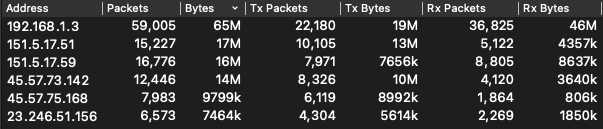
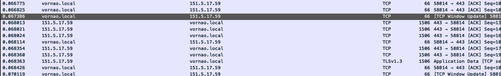
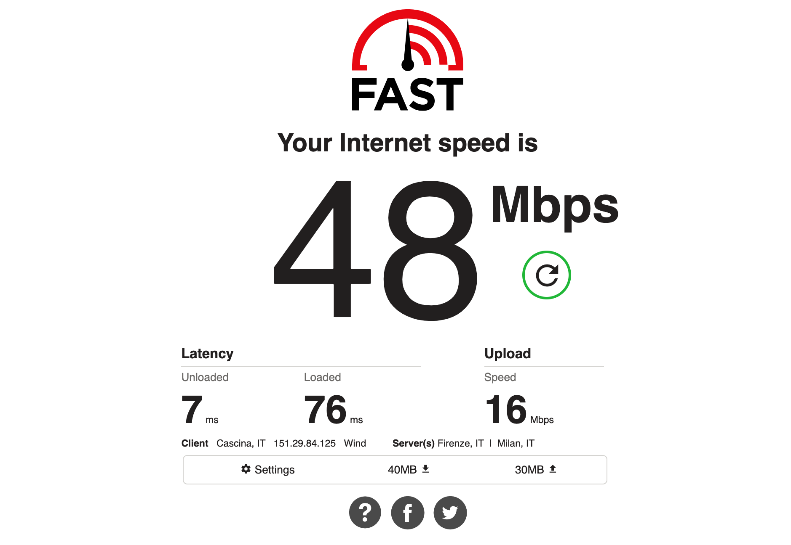
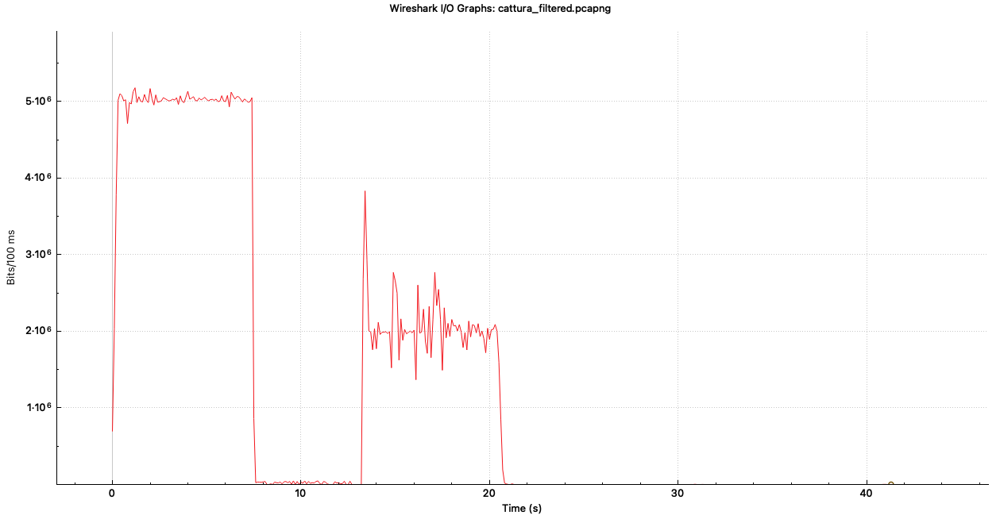

# Relazione Assignment 1 Gestione di reti

## Analisi del traffico di rete generato dal sito web fast.com con l'utilizzo di wireshark
A cura di Luca Miglior e Federico Ramacciotti

---
## Svolgimento della cattura
La cattura è stata avviata prima del collegamento al sito fast.com  

Il collegamento al sito fast.com determina l'inizio dello speedtest, che dura circa 20 secondi. Al termine dello speedtest, la cattura su wireshark è stata interrotta ed è stato analizzato il file .pcap generato per filtrare esclusivamente i pacchetti generati sulla rete dal sito web.

## Filtro applicato al traffico e Endpoints
Per creare i filtri da applicare alla cattura, si è ragionato sul funzionamento di un'applicazione di speedtest: questa deve inviare attraverso la rete grandi quantità di dati, ad un limitato numero di host, per poterne misurare la capacità.
Dunque, sotto questa ipotesi, sarà sufficiente individuare gli indirizzi ip che hanno inviato (e ricevuto) un consistente volume di dati: per fare ciò si utilizza la funzione di analisi statistica di wireshark, in particolare lo strumento Endpoints (Menu -> Statistics -> Endpoints):

 

Si vede come durante la cattura wireshark abbia individuato cinque host principali che hanno generato molto traffico da (e verso) la macchina utilizzata; si parla infatti di circa 65MB di dati totali scambiati fra fast.com e l'host locale ```192.168.1.3```

Dunque, per filtrare solo i pacchetti interessanti (nulla infatti garantisce che wireshark possa avere catturato anche altro traffico, non rilevente) si sono applicati questi filtri:  

 ```((((ip.addr == 151.5.17.59) || (ip.addr == 151.5.17.51)) || (ip.addr == 45.57.75.168)) || (ip.addr == 45.57.73.142)) || (ip.addr == 23.246.51.156) ```.


Da queste statistiche è anche possibile capire il funzionamento di FAST.com: l'applicazione apre più connessioni parallele dall'host locale verso host remoti da lui selezionati (in questo caso cinque, ma dalle impostazioni del servizio è possibile scegliere il numero minimo e massimo di connessioni desiderate per la misura) e misura il bitrate in funzione del tempo impiegato dal server (o dall'host locale) per ricevere una quantità nota di dati.  


Dopo la cattura è possibile effettuare reverse dns su questi indirizzi ip, e si nota come questi appartengano tutti a domini del tipo ```.nflxvideo.net``` o ```.netflix.com```

## Analisi dei pacchetti

I pacchetti filtrati sono tutti e soli quelli generati dallo speedtest. Essi si presentano come pacchetti TCP/TLS, come atteso, dal momento che fast.com utilizza una connessione HTTPS per lo scambio dei dati col client. Si può dire quindi che applicare un filtro TCP o un filtro sulla porta 443 non avrebbe impedito la cattura di altro traffico, oltre a quello di fast.com.

 

## Confronto fra i risultati di FAST.com e la cattura Wireshark

Alla conclusione dello speedtest, FAST.com ha prodotto il seguente risultato:



48Mbit/s in Download, e 16Mbit/s in upload, scambiando circa 70MB di dati in totale fra client e server.

La macchina 192.168.1.3, con wireshark, invece ha prodotto il seguente risultato:



Una media di 50Mbit/s in Download, e circa 20Mbit/s in Upload.

### Come spiegare questa differenza di circa 2-3 Mbit/s fra le due misurazioni?

FAST.com, dal momento che è stato avviato su un browser web, sarà in grado di "catturare" e misurare esclusivamente il traffico del livello applicativo dello stack TCP/IP. 
La misura dunque non tiene conto di tutto il traffico prodotto dai livelli sottostanti, in particolare dagli header del livello IP e Ethernet, la cui somma è circa 40Byte/pacchetto (~3% su pacchetti di 1500B);
Wireshark, invece, cattura i frame al livello della scheda di rete: nella sua misura sono quindi presenti tutti quei dati che FAST.com non può catturare.
